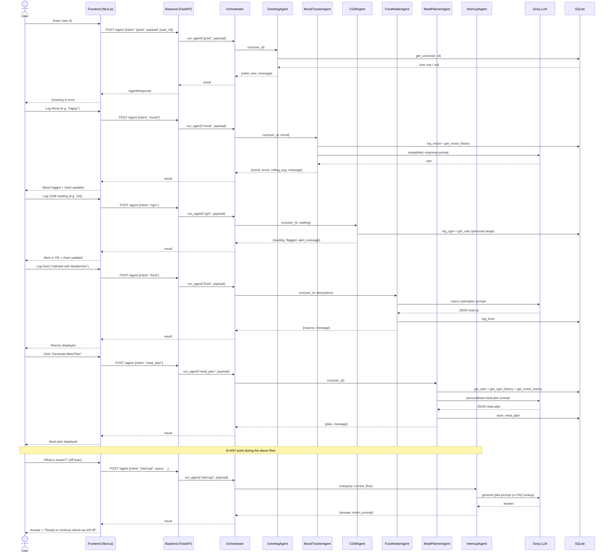

# Sequence Diagrams — Healthcare MultiAgent System

## Main Conversation Flow

```mermaid
sequenceDiagram
    actor U as User
    participant FE as Frontend (Next.js)
    participant BE as Backend (FastAPI)
    participant ORC as Orchestrator
    participant GA as GreetingAgent
    participant MA as MoodTrackerAgent
    participant CA as CGMAgent
    participant FA as FoodIntakeAgent
    participant MP as MealPlannerAgent
    participant IA as InterruptAgent
    participant LLM as Groq LLM
    participant DB as SQLite

    U->>FE: Enter User ID
    FE->>BE: POST /agent {intent: "greet", payload: {user_id}}
    BE->>ORC: run_agent("greet", payload)
    ORC->>GA: run(user_id)
    GA->>DB: get_user(user_id)
    DB-->>GA: user row / null
    GA-->>ORC: {valid, user, message}
    ORC-->>BE: result
    BE-->>FE: AgentResponse
    FE-->>U: Greeting or error

    U->>FE: Log Mood (e.g. "happy")
    FE->>BE: POST /agent {intent: "mood"}
    BE->>ORC: run_agent("mood", payload)
    ORC->>MA: run(user_id, mood)
    MA->>DB: log_mood + get_mood_history
    MA->>LLM: empathetic response prompt
    LLM-->>MA: text
    MA-->>ORC: {mood, score, rolling_avg, message}
    ORC-->>FE: result
    FE-->>U: Mood logged + chart updated

    U->>FE: Log CGM reading (e.g. 145)
    FE->>BE: POST /agent {intent: "cgm"}
    BE->>ORC: run_agent("cgm", payload)
    ORC->>CA: run(user_id, reading)
    CA->>DB: log_cgm + get_user (personal range)
    CA-->>ORC: {reading, flagged, alert_message}
    ORC-->>FE: result
    FE-->>U: Alert or OK + chart updated

    U->>FE: Log food ("oatmeal with blueberries")
    FE->>BE: POST /agent {intent: "food"}
    BE->>ORC: run_agent("food", payload)
    ORC->>FA: run(user_id, description)
    FA->>LLM: macro estimation prompt
    LLM-->>FA: JSON macros
    FA->>DB: log_food
    FA-->>ORC: {macros, message}
    ORC-->>FE: result
    FE-->>U: Macros displayed

    U->>FE: Click "Generate Meal Plan"
    FE->>BE: POST /agent {intent: "meal_plan"}
    BE->>ORC: run_agent("meal_plan", payload)
    ORC->>MP: run(user_id)
    MP->>DB: get_user + get_cgm_history + get_mood_history
    MP->>LLM: personalised meal plan prompt
    LLM-->>MP: JSON meal plan
    MP->>DB: save_meal_plan
    MP-->>ORC: {plan, message}
    ORC-->>FE: result
    FE-->>U: Meal plan displayed

    Note over U,IA: At ANY point during the above flow:
    U->>FE: "What is insulin?" (off-topic)
    FE->>BE: POST /agent {intent: "interrupt", query: ...}
    BE->>ORC: run_agent("interrupt", payload)
    ORC->>IA: run(query, current_flow)
    IA->>LLM: general Q&A prompt (or FAQ lookup)
    LLM-->>IA: answer
    IA-->>ORC: {answer, return_prompt}
    ORC-->>FE: result
    FE-->>U: Answer + "Ready to continue where we left off"
```
